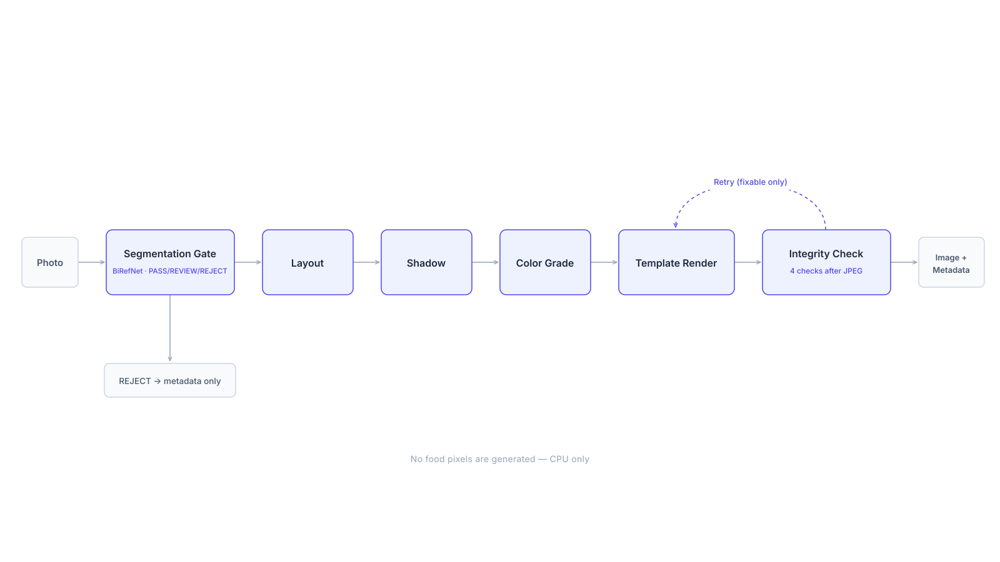

# MenuAI - 料理写真の合成エンジン

飲食店がスマートフォンで撮った料理写真を、背景を整えたメニュー用画像に変換します。
**料理そのもののピクセルは一切生成し直しません。** 料理を切り抜き、グラフィックテンプレートの上に配置し、影と色補正を加えたうえで、整合性検証を通過したものだけを返します。


<sub>左: 入力写真。右: `T01_warm_ivory`、`T04_dark_premium`、`T05_japanese_editorial`。写真のクレジット: [docs/images/CREDITS.md](docs/images/CREDITS.md)</sub>

このリポジトリは AI サービス側です。加盟店向けの Web アプリ（Laravel: アカウント、クレジット、アップロード、ステータス確認）は別リポジトリ [`menu-ai`](https://github.com/doromi22/menu-ai) にあり、HTTP でこのサービスを呼び出します。

## なぜ画像生成モデルを使わないのか

初期のプロトタイプ（`main.py`、`modal_app.py`）は GPU 上の SDXL で背景を生成していました。しかしメニュー写真では、お客様は写真に写っているものを注文します。拡散モデルは量・トッピング・質感を気づかないうちに変えてしまうことがあり、景品表示法の観点からも既定の方式にはできません。
そこで `standard/` の **Standard パイプライン**は、CPU で動く決定的な合成処理にしました。生成モデルの方式は、明示的に選んだときだけ使う `premium` モードとして残しています。

## パイプライン



- **Segmentation Gate**（`standard/segmentation/`）: 料理を切り抜き、PASS / REVIEW / REJECT と機械可読な理由コード（料理が小さすぎる、フレーム端に接している、穴がある など）を返します。バックエンド自体の障害は `is_infra_error` 付きの REJECT として区別し、再試行は経過時間の予算内に制限しているため、API のタイムアウトを超えることはありません。
- **整合性検証**（`standard/validator/`）: 加盟店が実際に受け取る画像（JPEG 圧縮後）に対して 4 つのモジュールで検査します。マスクの整合性、期待される補正結果と比べた細部の欠落・捏造、元写真と比べた彩度・輝度の上昇、レイアウト上の順位・重なりの変化です。
- **再試行ステートマシン**（`standard/retry/`）: 別のパラメータで直る違反だけを再試行します（より控えめ・ニュートラルな色補正、スケール 1.0 の強制、配置の再計算）。同じ処理を闇雲に繰り返すことはしません。
- **ポリシー**（`standard/policy/`）: しきい値はハッシュ付きでバージョン管理された YAML にあり、すべてのレスポンスに判定時のポリシーハッシュを記録します。
- **テストハーネス**（`mvp_harness/`）: 写真 × テンプレートを一括実行し、カテゴリ × テンプレートの合格率マトリクスを出力します。

## 実写真で見つかった問題と対応

合成データのテストは通っていましたが、実際の飲食店の写真では見た目に問題がありました。報告された不具合は 3 つです。器の一部が欠ける、海苔が消える、箸の輪郭がギザギザになる。

### 1. 器やトッピングの欠落: 原因はコードではなくモデル

しきい値処理の前の、セグメンテーションモデルの生出力を書き出して確認したところ、欠けている領域はその時点ですでに失われていました。つまり後処理では取り戻せません。
そこで MIT ライセンスの BiRefNet チェックポイント 3 種類を、問題の写真で比較しました（BRIA RMBG 2.0 は非商用ライセンスのため最初から除外）。`birefnet-dis` は 1 枚を改善した一方で、別の写真では器全体を失いました。**`birefnet-hrsod`** は新たな失敗を生まずに問題の写真を改善したため、これを採用しました。比較の詳細: [`standard/segmentation/README.md`](standard/segmentation/README.md)

| 旧モデル（`birefnet-general`） | 採用モデル（`birefnet-hrsod`） |
|---|---|
|  |  |
| 器が丸ごと消え、料理の部分だけが残っている。 | 器は戻ったが、ソースの容器や隣の器まで取り込まれている。 |

右側の画像はそのままトレードオフを示しています。新しいモデルは取り込む範囲が広く、料理の近くにある小物も一緒に切り抜きます。
ラーメンの写真セットでは、これが**合格率 92% → 77% の低下**として現れました。写真ごとに追跡すると、新たに REVIEW になったのは切り抜きが悪化したからではありませんでした。ある写真では旧モデルが大きな海苔 2 枚を黙って消しており、それを正しく復元した結果、マスクがフレーム上端に接し、境界チェックが正しく反応したのです。**不具合を直したことで、その不具合が隠していた問題が表に出た**ケースでした。

### 2. 輪郭のギザギザ: 合成処理でのハードしきい値

Gate はモデルの連続値アルファを 0/1 のマスクに二値化しており、描画もそのマスクでそのまま合成していました。そのため、モデルがすでに予測しているアンチエイリアスの輪郭が捨てられていました。
現在は各オブジェクトがソフトアルファも保持し、**合成時にだけ**、しかも輪郭付近の細い帯でのみ使います（内部は不透明のままなので、スープが透けることはありません）。判定や検証はすべて従来の二値マスクで行うため、**78 件の判定は 1 件も変わっていません。**

| 修正前（二値マスク） | 修正後（輪郭のソフトアルファ） |
|---|---|
|  |  |

<sub>フォークの柄。最近傍補間で 4 倍に拡大。</sub>

## 実写真での結果

| カテゴリ | 写真数 | 合格率 | REVIEW | REJECT |
|---|---|---|---|---|
| デザート | 14 | **100%** | 0 | 0 |
| パスタ | 14 | 71% | 18 | 6 |
| ラーメン | 13 | 77% | 18 | 0 |
| 丼 | 12 | 67% | 24 | 0 |

件数は「写真 × テンプレート」の組み合わせ単位です（1 枚につき 6 テンプレート）。REVIEW と REJECT はいずれも写真単位で発生しています（1 枚 = 6 件）。
ラーメンの写真は出所を確認できていない加盟店風のスマートフォン写真のため、公開していません。その他のカテゴリは `scripts/collect_test_photos.py` で収集した自由ライセンスの Wikimedia Commons 写真で、ファイルごとのライセンス台帳も同時に出力されます。
REJECT は、皿の縁がフレームに入らないほどの極端な接写 1 枚だけです。REVIEW の理由は、料理がフレーム端に接している（最多）、彩度の上昇、ほぐれた麺の間の穴、そして主菜を特定できない定食トレー 1 枚です（下記「既知の制約」参照）。

処理時間（CPU のみ、GPU なし）: API 1 リクエスト（1 テンプレート）あたり約 6〜12 秒。ハーネスは写真 1 枚につきセグメンテーションを 1 回だけ行い、6 テンプレート分で中央値 14.5 秒です（以前はテンプレートごとにセグメンテーションを繰り返しており 42.7 秒でした）。

## 既知の制約

- **小物が取り込まれる。** 採用モデルは旧モデルより、紙ナプキン・ソース容器・隣の器を一緒に切り抜きやすくなっています。
- **器の欠落は減ったが、解消はしていない。** ガラスの器や一部の皿は今も抜け落ちます。
- **フレーム端での直線的な切れ目。** 写真の端に接していた料理を中央に寄せると、元の写真の外側だった部分が直線で切れて見えます。
- **役割分類器がない。** 最も大きいオブジェクトを主菜とみなしているため、定食トレーは REVIEW になります。
- 仕様書で数値が定められているのは `T01_warm_ivory` だけです。`T02`〜`T06` は実写真での調整待ちの仮パラメータです。
- 非常に大きな写真（例: 3024×4032）では、100% 表示で輪郭がやや柔らかく見えます。これは約 1024px で動くモデルの解像度によるもので、ぼかしを加えているわけではありません。

## 実行方法

```bash
python -m venv venv && ./venv/Scripts/python.exe -m pip install -r standard/requirements.txt
```

```bash
./venv/Scripts/python.exe -m pytest                      # 単体・API テスト 185 件（モデルのダウンロード不要）
./venv/Scripts/python.exe -m pytest -m integration       # 実際の BiRefNet 推論（初回は約 1GB をダウンロード）
```

```bash
./venv/Scripts/python.exe -m uvicorn standard.api.main:app --port 8002    # Web アプリから呼ばれる API
./venv/Scripts/python.exe -m mvp_harness photos/ramen photos/out           # 一括実行: 全写真 × 6 テンプレート
./venv/Scripts/python.exe scripts/build_readme_assets.py                   # 上記の画像を再生成
```

ハーネスはカテゴリ名を先頭に付けたファイル名（`ramen_001.jpg`）を前提にしています。写真・出力画像・モデルの重みはリポジトリで管理していません。

## ディレクトリ構成

```
standard/        Standard パイプライン（segmentation, layout, shadow, color, templates, validator, retry, policy, api）
mvp_harness/     写真 × テンプレートの一括実行とマトリクスレポート
scripts/         写真収集、モデル比較、診断、README 用画像の生成
docs/            HTTP 契約とレスポンスメタデータの JSON スキーマ
main.py, modal_app.py   初期の生成モデル方式（Premium）のプロトタイプ
```

コード内のコメントとモジュールごとの README は英語で書いています。仕様書の原文（韓国語）を引用している箇所があります。
