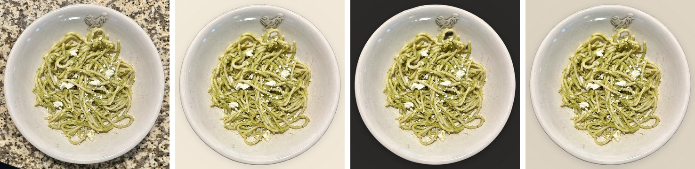
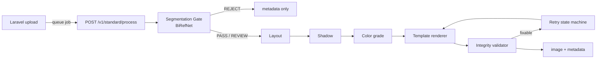
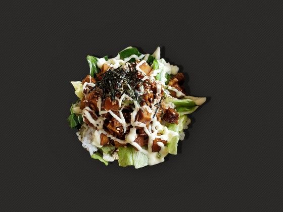
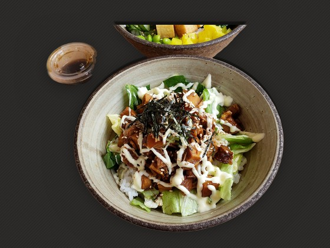
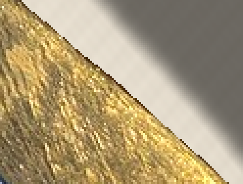
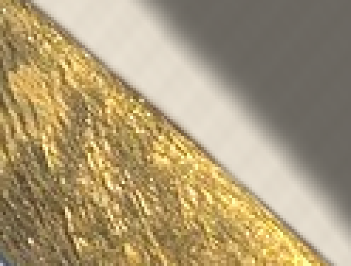

# MenuAI - food photo compositing engine

Turns a restaurant's phone photo of a dish into a clean menu image on a
styled background - **without regenerating a single food pixel**. The dish
is cut out, placed on a graphic template, shadowed and color-graded, then
checked by an integrity validator before anything is returned.



<sub>Left: input photo. Right: `T01_warm_ivory`, `T04_dark_premium`, `T05_japanese_editorial`. Photo credits: [docs/images/CREDITS.md](docs/images/CREDITS.md).</sub>

This repository is the AI service. The merchant-facing web app (Laravel:
accounts, credits, upload, status polling) lives in the separate `menu-ai`
repository and calls this service over HTTP.

## Why not just use a generative model?

An earlier prototype (`main.py`, `modal_app.py`) generated backgrounds with
SDXL on a GPU. For menu photos that is the wrong default: a customer orders
what the picture shows, and a diffusion model can quietly change portion
size, garnish, or texture. The **Standard** pipeline in `standard/` is
deterministic compositing on CPU instead - the generative engine is kept
only as an opt-in `premium` mode.

## Pipeline



- **Segmentation Gate** (`standard/segmentation/`) - cuts the dish out and
  returns PASS / REVIEW / REJECT with machine-readable reason codes (food
  too small, touching the frame edge, holes, ...). A backend crash is a
  separate `is_infra_error` REJECT, retried under an elapsed-time budget so
  retries can never outlast the API timeout.
- **Integrity validator** (`standard/validator/`) - four modules check what
  the merchant actually receives (after JPEG compression): mask integrity,
  lost or invented fine detail versus the expected graded food, saturation /
  luminance gain versus the original, and layout rank / occlusion changes.
- **Retry state machine** (`standard/retry/`) - only retries failures a
  different parameter can fix (a more conservative or neutral color grade,
  forcing scale 1.0, recomputing placement); never blind re-runs.
- **Policy** (`standard/policy/`) - thresholds live in a hashed, versioned
  YAML; every response records the policy hash it was judged under.
- **Test harness** (`mvp_harness/`) - runs photos x templates and writes a
  category x template pass-rate matrix.

## What real photos broke, and what changed

Synthetic tests passed; the first batch of real restaurant photos did not
look right. Three defects were reported: bowls partly missing, nori
disappearing, and jagged edges on chopsticks.

### 1. Bowls and toppings missing - the model, not the code

Dumping the segmentation model's raw output (before any thresholding)
showed the missing regions were already absent there, so no
post-processing could recover them. Three MIT-licensed BiRefNet checkpoints
were compared on the failing photos (BRIA RMBG 2.0 was ruled out up front:
its license is non-commercial). `birefnet-dis` fixed one photo but lost the
whole bowl on another; **`birefnet-hrsod`** improved the failing photos
without introducing new failures and was adopted. Full comparison:
[`standard/segmentation/README.md`](standard/segmentation/README.md).

| Previous model (`birefnet-general`) | Adopted (`birefnet-hrsod`) |
|---|---|
|  |  |
| The bowl is gone; only the food heap survives. | Bowl recovered - but the sauce cup and a neighbouring bowl are pulled in too. |

The right-hand image is the honest tradeoff: the new model is more
inclusive, so props near the dish come along. On the ramen set this showed
up as the **pass rate dropping from 92% to 77%**. Tracing it photo by photo,
the new REVIEWs were not worse cutouts: in one photo the old model had been
silently deleting two large nori sheets, and restoring them put the mask
against the top of the frame - which the boundary check correctly flagged.
A fix exposed a problem the bug had been hiding.

### 2. Jagged edges - hard threshold in the compositor

The gate thresholds the model's soft alpha into a boolean mask, and the
renderer composited with that mask, discarding the anti-aliased edge the
model already predicts. Now each object also carries the soft alpha,
**used only for compositing** and only in a thin rim around the edge (the
interior stays opaque, so broth never turns translucent). Every metric and
validator check still reads the hard mask - verified: **0 of 78 verdicts
changed**.

| Before (hard mask) | After (soft alpha rim) |
|---|---|
|  |  |

<sub>Fork handle, 4x nearest-neighbour zoom.</sub>

## Results on real photos

| Category | Photos | Pass | Review | Reject |
|---|---|---|---|---|
| Dessert | 14 | **100%** | 0 | 0 |
| Pasta | 14 | 71% | 18 | 6 |
| Ramen | 13 | 77% | 18 | 0 |
| Donburi | 12 | 67% | 24 | 0 |

Counts are image x template pairs (6 templates each). Ramen photos are
merchant-style phone shots of unverified provenance and are not published;
the other categories are freely-licensed Wikimedia Commons photos collected
by `scripts/collect_test_photos.py`, which writes a per-file license ledger.
Each non-zero REVIEW/REJECT count comes from whole photos (6 pairs each).
The only REJECT is an extreme close-up with no plate edge in frame. REVIEW
reasons: food touching the frame edge (most common), over-saturated color,
holes between loose noodles, and one set-meal tray where no single "main"
dish can be identified yet (see limitations).

CPU inference, no GPU: 5.5-12.7 s per image-template pair (median 6.9 s).

## Known limitations

- **Props get included.** The adopted model pulls in napkins, sauce cups
  and neighbouring dishes more often than the old one.
- **Bowl loss is reduced, not solved** - glass bowls and some plates are
  still dropped.
- **Straight cut at the frame edge.** An object that touched the photo edge
  shows a straight cut after being re-centred.
- **No role classifier.** The largest object is treated as the main dish;
  set-meal trays go to REVIEW.
- Only `T01_warm_ivory` uses spec-given parameters; `T02`-`T06` are
  placeholders awaiting tuning against real photos.
- Soft edges on very large photos (e.g. 3024x4032) look slightly soft at
  100% zoom - that is the model's ~1024 px working resolution, not added blur.

## Running it

```bash
python -m venv venv && ./venv/Scripts/python.exe -m pip install -r standard/requirements.txt
```

```bash
./venv/Scripts/python.exe -m pytest                      # 183 unit/API tests, no model download
./venv/Scripts/python.exe -m pytest -m integration       # real BiRefNet inference (~1 GB download on first run)
```

```bash
./venv/Scripts/python.exe -m uvicorn standard.api.main:app --port 8002    # the API the web app calls
./venv/Scripts/python.exe -m mvp_harness photos/ramen photos/out           # batch: every photo x 6 templates
./venv/Scripts/python.exe scripts/build_readme_assets.py                   # rebuild the images above
```

The harness expects category-prefixed filenames (`ramen_001.jpg`). Photos,
rendered outputs and model weights are not tracked.

## Layout

```
standard/        the Standard pipeline (segmentation, layout, shadow, color, templates, validator, retry, policy, api)
mvp_harness/     photos x templates batch runner + matrix report
scripts/         photo collection, model comparison, diagnostics, README assets
docs/            HTTP contract and response metadata JSON schema
main.py, modal_app.py   earlier generative (Premium) prototype
```
